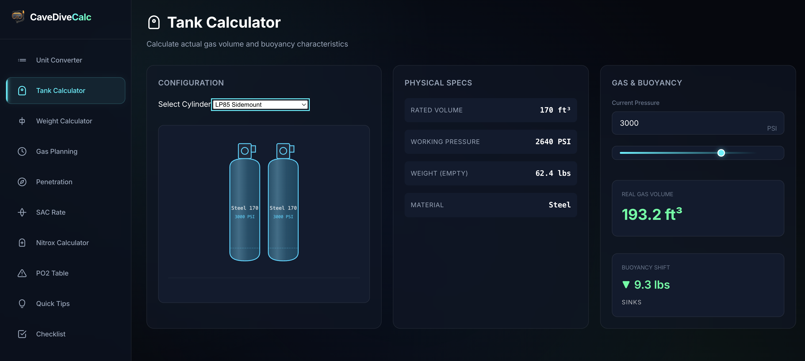
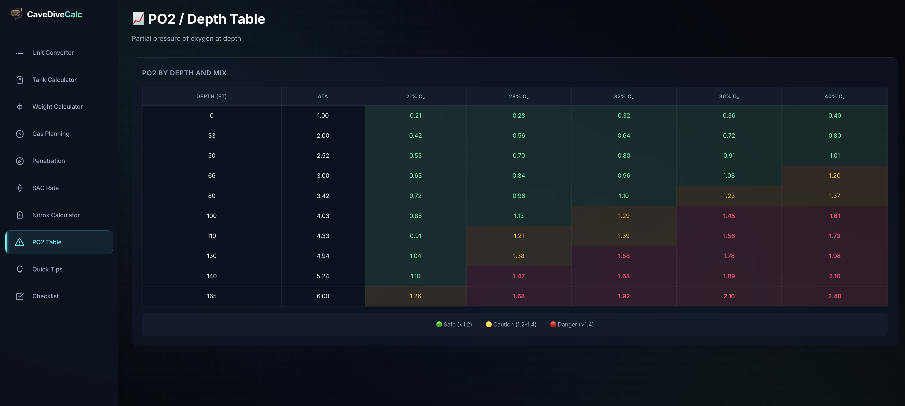

# Cave Diving Calculator

> ⚠️ **DISCLAIMER:** Not all calculations provided by this application may be 100% accurate. **NEVER break your training limits.** This application is simply an effort to have better visual tools for dive planning, and for the community to code and improve it together. Always verify your dive plan manually and consult your training agencies' guidelines.

A comprehensive web-based calculator designed specifically for cave diving planning and safety. It provides a suite of tools to calculate gas planning, SAC rates, Nitrox mixes, PO2, weight requirements, and more.

## Previews

*(Please place your screenshot images in the `assets/` directory named `tank_calculator.png` and `po2_table.png`)*

## Features

- **Unit Converter**: Easily convert between Imperial and Metric units for pressure, depth, volume, and temperature.
- **Tank Calculator**: Calculate actual gas volume and buoyancy characteristics for various cylinder types (Steel HP100, LP85, AL80, Sidemount, etc.).
- **Weight Calculator**: Calculate ballast weight needed for neutral buoyancy based on diver profile, wetsuit/drysuit type, and BCD/harness configuration.
- **Gas Planning**: Rule of Thirds and reserve calculations based on tank configuration and starting pressure.
- **Penetration Calculator**: Calculate maximum safe penetration distance based on team gas planning, SAC rates, depth, and swim speed.
- **SAC Rate Calculator**: Calculate Surface Air Consumption (SAC) and Respiratory Minute Volume (RMV).
- **Nitrox Calculator**: Calculate Maximum Operating Depth (MOD), Best Mix, and Equivalent Air Depth (EAD).
- **PO2 Table**: View partial pressure of oxygen at various depths for different Nitrox mixes.
- **Quick Tips**: Mental math shortcuts for faster underwater calculations.
- **Pre-Dive Checklist**: A comprehensive checklist for cave diving equipment and procedures.

## Technologies Used

- HTML5
- CSS3 (Vanilla)
- JavaScript (Vanilla)
- Font: Inter (Google Fonts)

## Usage

Simply open the `index.html` file in any modern web browser to start using the calculator. No installation or server is required.

## License

This project is licensed under the GNU General Public License v3.0 (GPL-3.0) - see the [LICENSE](LICENSE) file for details.
